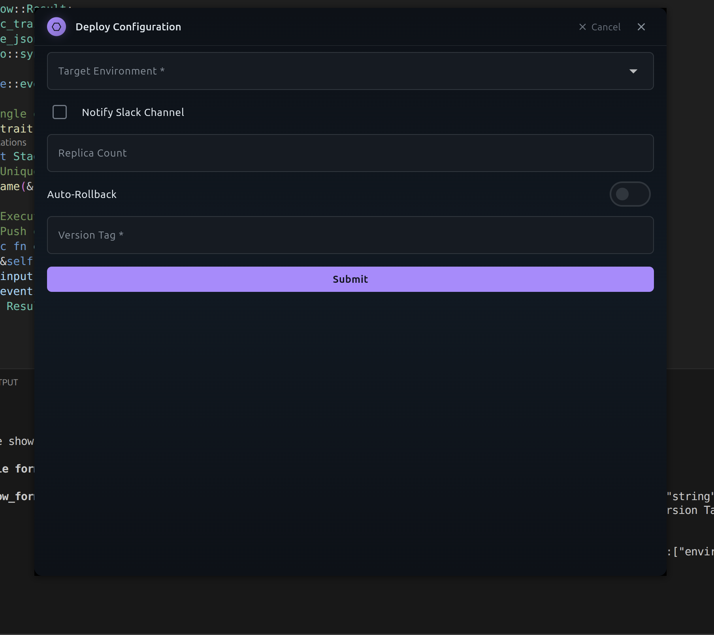
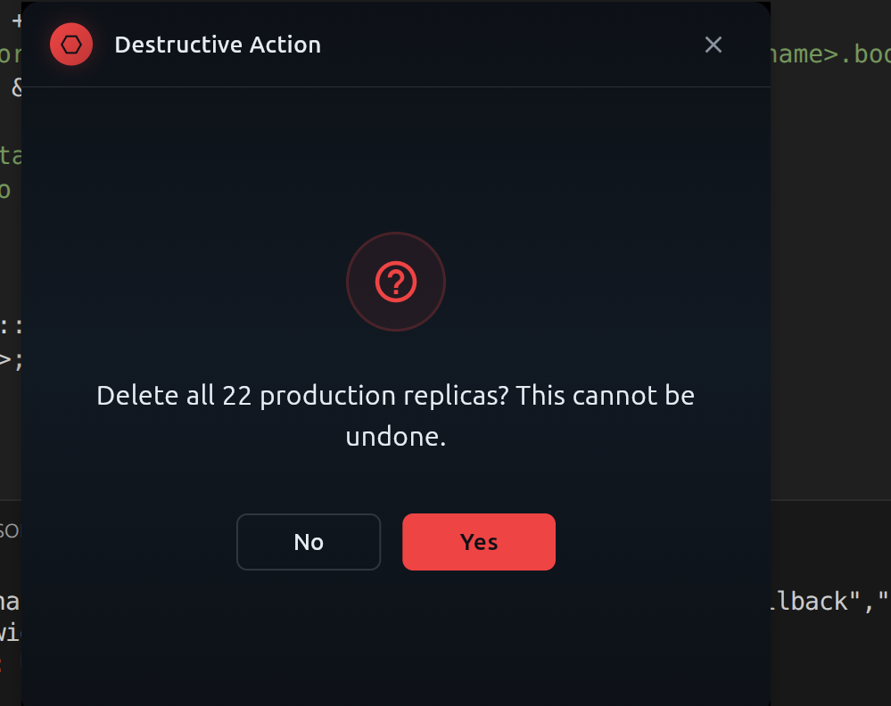
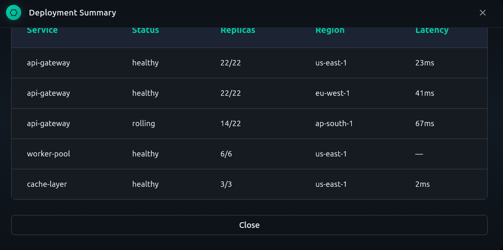

<div align="center">

# Niobium

**Native GUI runtime for CLI AI agents**

Give Claude Code, Codex, Gemini CLI, and any MCP-compatible agent
the power of native desktop UI — forms, confirmations, rich output —
without leaving the terminal.

[Install](#install) &bull; [How It Works](#how-it-works) &bull; [Tools](#tools) &bull; [Secure Pipeline](#secure-pipeline-engine) &bull; [Display Params](#display-params) &bull; [Architecture](#architecture)

---



<sub>An agent requests a deploy configuration form — purple accent, wide layout, compact density</sub>

</div>

## The Problem

CLI AI agents are powerful but blind. When they need user input, they're stuck with `read -p` prompts and `yes/no` shell hacks. When they want to show results, they dump raw text to stdout. There's no way to collect structured data, confirm destructive actions with visual weight, or display rich content.

## The Solution

Niobium is an MCP server that gives agents native desktop GUI. An agent calls `show_form()` via the Model Context Protocol — Niobium renders a native window, waits for the user, returns the result. The agent never touches UI code. It just describes what it needs.

```
CLI Agent ──MCP (stdio)──> Niobium ──> Native Desktop Window ──> User
                                <── structured JSON result ──<
```

<div align="center">
<table>
<tr>
<td align="center">

<br /><sub>Red accent for destructive confirmations</sub>
</td>
<td align="center">

<br /><sub>Rich table output with teal accent</sub>
</td>
</tr>
</table>
</div>

## Install

```bash
npm install -g niobium-mcp
```

That's it. Pre-built native binaries for your platform are downloaded automatically.

Then add Niobium to your agent's MCP config. For **Claude Code**, add to `.mcp.json`:

```json
{
  "mcpServers": {
    "niobium": {
      "type": "stdio",
      "command": "niobium"
    }
  }
}
```

Restart your agent. Niobium tools are now available.

> **Supported platforms:** Linux x64, macOS x64, macOS ARM64 (Apple Silicon), Windows x64.

## How It Works

1. **Agent decides** it needs user input (or wants to display something)
2. **Agent calls** an MCP tool — `show_form`, `show_confirmation`, or `show_output`
3. **Niobium renders** a native desktop window with the requested content
4. **User interacts** — fills the form, clicks Yes/No, reads and dismisses
5. **Niobium returns** structured JSON to the agent over MCP

The agent provides *context* (what data to collect, what to display). Niobium provides *UX* (which widget to use, how to lay it out, how to validate).

## Tools

### `show_form`

Collect structured input via a native form window. Pass a JSON Schema — Niobium renders the right widgets automatically.

```json
{
  "title": "Deploy Configuration",
  "schema": {
    "type": "object",
    "properties": {
      "environment": { "type": "string", "enum": ["staging", "production"] },
      "version":     { "type": "string", "title": "Version Tag" },
      "replicas":    { "type": "integer", "minimum": 1, "maximum": 50 },
      "notify":      { "type": "boolean", "title": "Notify Slack" }
    },
    "required": ["environment", "version"]
  },
  "width": "wide",
  "density": "compact",
  "accent": "purple"
}
```

**Supported field types:**
text, number, integer, boolean (checkbox / toggle), enum (dropdown), date / time pickers, file / directory pickers, password, color picker, slider, multi-select, data grids, and remote data sources with scale-aware component selection.

### `show_confirmation`

Yes/No dialog with visual weight. Use `accent: "red"` for destructive actions.

```json
{
  "title": "Destructive Action",
  "message": "Delete all production replicas? This cannot be undone.",
  "accent": "red",
  "width": "narrow",
  "height": "short"
}
```

### `show_output`

Display read-only content in a native window. Supports multiple formats:

| Format | Description |
|--------|-------------|
| `text` | Plain monospace text |
| `markdown` | Rendered markdown |
| `json` | Syntax-highlighted, pretty-printed JSON |
| `table` | Data table from `{headers, rows}` JSON |
| `diff` | Colored unified diff |
| `tabbed` | Multiple tabs, each with its own format |

```json
{
  "title": "Deployment Summary",
  "output_type": "table",
  "content": "{\"headers\":[\"Service\",\"Status\"],\"rows\":[[\"api\",\"healthy\"]]}",
  "width": "wide",
  "accent": "blue"
}
```

### `save_form` / `show_saved_form` / `list_forms`

Persist form schemas for reuse. Versioned — saving the same name creates a new version.

## Display Params

All visual tools accept optional display parameters. Agents control appearance without pixel-level thinking.

### Window Size

| Param | Presets | Default |
|-------|---------|---------|
| `width` | `"narrow"` (420) &bull; `"normal"` (580) &bull; `"wide"` (800) &bull; `"full"` (1100) | `"normal"` |
| `height` | `"short"` (400) &bull; `"normal"` (720) &bull; `"tall"` (900) &bull; `"full"` (1080) | `"normal"` |

Or pass exact pixel values: `"width": 650`

### Accent Color

| Name | Hex | Semantic Use |
|------|-----|-------------|
| `"teal"` | `#00D4AA` | Default |
| `"blue"` | `#4A9EFF` | Professional / informational |
| `"purple"` | `#A78BFA` | Creative / configuration |
| `"amber"` | `#F59E0B` | Attention / warning |
| `"red"` | `#EF4444` | Danger / destructive |
| `"green"` | `#22C55E` | Success / positive |

Or pass any hex: `"accent": "#FF6B35"`

The accent color themes the entire window — title bar icon, buttons, focus rings, table headers, checkboxes, progress indicators.

### Form-Only Params

| Param | Values | Default | Effect |
|-------|--------|---------|--------|
| `density` | `"compact"` / `"normal"` / `"comfortable"` | `"normal"` | Field spacing and padding |
| `animate` | `true` / `false` | `true` | Stagger animation on form fields |

## Scale-Aware Component Intelligence

For fields with remote data sources (`x-source`), Niobium automatically picks the optimal widget based on data scale:

| Estimated Count | Widget | Description |
|----------------|--------|-------------|
| 1 -- 5 | Radio buttons | Inline selection |
| 6 -- 25 | Dropdown | Simple dropdown |
| 26 -- 200 | Searchable dropdown | Client-side filtering |
| 201 -- 2000 | Autocomplete | Server-side search |
| 2000+ | Modal search | Full page with filters + pagination |

The agent declares the data source. Niobium fetches the data and picks the widget. The agent never touches HTTP calls or UI layout.

## Secure Pipeline Engine

AI agents shouldn't handle credentials. When a form collects a password, API key, or token, that secret should flow directly to the target service — never passing through the agent's context window where it could be logged, cached, or leaked.

Niobium solves this with **`x-pipe`**: declarative multi-stage data pipelines that execute *inside* the Niobium process. The agent defines the pipeline. The user fills the form. Niobium runs the stages. Secrets never leave the secure boundary.

```
Agent defines pipeline ──► User fills form ──► Niobium executes stages ──► Agent gets results
                                                     │
                                            Secrets stay here.
                                            Agent never sees them.
```

### How It Works

```json
{
  "title": "Deploy to Production",
  "schema": {
    "type": "object",
    "properties": {
      "api_key":     { "type": "string", "title": "API Key", "x-sensitive": true },
      "environment": { "type": "string", "enum": ["staging", "production"] },
      "version":     { "type": "string" }
    },
    "required": ["api_key", "environment", "version"]
  },
  "x-pipe": [
    {
      "name": "auth",
      "url": "https://api.example.com/auth",
      "method": "POST",
      "headers": { "X-API-Key": "${api_key}" }
    },
    {
      "name": "extract_token",
      "expr": "pipe.auth.body.token"
    },
    {
      "name": "deploy",
      "url": "https://api.example.com/deploy",
      "method": "POST",
      "headers": { "Authorization": "Bearer ${pipe.extract_token}" },
      "body": { "env": "${environment}", "version": "${version}" }
    }
  ],
  "accent": "red"
}
```

The agent receives:

```json
{
  "form": { "api_key": "<<REDACTED>>", "environment": "production", "version": "2.1.0" },
  "pipe": {
    "auth": { "status": 200 },
    "deploy": { "status": 200, "body": { "deploy_id": "d-3fa8", "status": "rolling" } }
  }
}
```

The API key was used in the pipeline but **never returned to the agent**.

### SecureContext

All form fields are **sensitive by default** (`x-sensitive` defaults to `true`). SecureContext extracts secrets before pipeline execution, replacing them with opaque nonce placeholders (`<<NB:abc123:api_key>>`). Only trusted stages (HTTP) see resolved values — untrusted stages (subprocess) see placeholders. After execution, results are scrubbed to catch APIs that echo secrets back.

This means even a misconfigured pipeline or a misbehaving external API can't leak credentials to the agent.

### Stage Types

Stages are inferred from their shape — no explicit `type` field needed:

| Field Present | Stage Type | Description |
|--------------|-----------|-------------|
| `url` | **HTTP** | Call an API endpoint (trusted — sees secrets) |
| `command` | **Process** | Run a subprocess (untrusted — sees placeholders) |
| `expr` | **Transform** | Extract a value from a previous stage's output |
| `message` | **Toast** | Emit a UI notification |
| `fields` | **Redact** | Explicitly redact fields from the result |
| `branches` | **Parallel** | Run multiple sub-pipelines concurrently |

### Template Interpolation

Pipeline values use `${}` templates that resolve against form data and previous stage outputs:

| Template | Resolves To |
|----------|------------|
| `${field_name}` | Form field value |
| `${pipe.stage.body.path}` | Previous stage output |
| `${env:VAR}` | Environment variable |

### Parallel Branches

Run independent pipelines concurrently with automatic fan-out/fan-in:

```json
{
  "name": "multi_region",
  "branches": {
    "us": [
      { "name": "deploy_us", "url": "https://us.api.example.com/deploy", "method": "POST" }
    ],
    "eu": [
      { "name": "deploy_eu", "url": "https://eu.api.example.com/deploy", "method": "POST" }
    ]
  }
}
```

Each branch gets its own SecureContext. First failure aborts all branches.

### Direct Sink

For the simplest case — form data goes directly to an API, no multi-stage needed:

```json
{
  "schema": { "..." },
  "x-sink": {
    "url": "https://api.example.com/submit",
    "method": "POST"
  }
}
```

Sensitive fields are redacted from the agent response. The agent knows the request succeeded but never sees what was sent.

## Architecture

```
┌─────────────────────────────────────────────────┐
│                  Flutter Desktop App              │
│                                                   │
│  ┌──────────────┐  ┌──────────────────────────┐  │
│  │  Rust MCP     │  │  Flutter UI Engine        │  │
│  │  Server       │  │                          │  │
│  │  (FFI)       ◄──►  Dynamic Form Renderer    │  │
│  │              │  │  Confirmation Dialog      │  │
│  │  rmcp 0.16   │  │  Output Display          │  │
│  │  Event Bus   │  │  Scale-Aware Widgets     │  │
│  │  Schema Store│  │  Glass Morphism Theme    │  │
│  │  Pipeline    │  │                          │  │
│  └──────┬───────┘  └──────────────────────────┘  │
│         │ stdio (JSON-RPC 2.0)                    │
└─────────┼─────────────────────────────────────────┘
          │
    ┌─────▼─────┐
    │  CLI Agent │   Claude Code, Codex, Gemini CLI,
    │  (MCP)     │   or any MCP-compatible agent
    └───────────┘
```

Single process — Rust MCP server runs in-process via `flutter_rust_bridge` FFI. No HTTP, no IPC, no second process. The event bus coordinates everything through typed channels.

### Tech Stack

| Layer | Technology |
|-------|-----------|
| MCP Protocol | rmcp 0.16, JSON-RPC 2.0 over stdio |
| Server Logic | Rust, tokio, rusqlite, serde |
| FFI Bridge | flutter_rust_bridge 2.11 |
| Desktop UI | Flutter 3.7+, Material 3 |
| Pipeline Engine | niobium-pipe (Rust), SecureContext |
| Window Management | window_manager (frameless, always-on-top) |

## Compatible Agents

Any agent that speaks MCP over stdio:

- **Claude Code** (Anthropic)
- **Codex CLI** (OpenAI)
- **Gemini CLI** (Google)
- Custom agents via the MCP SDK

## Development

Building from source requires Rust 1.82+ and Flutter SDK 3.7+ (Linux desktop).

```bash
make build      # Full release build (Rust + Flutter + bundle native library)
make dev        # Debug build (faster iteration)
make test       # All tests + clippy + flutter analyze
make codegen    # Regenerate flutter_rust_bridge bindings
make clean      # Remove all build artifacts
```

## Contributing

Niobium is not accepting external contributions at this time. If you find a bug or have a feature request, please [open an issue](https://github.com/ricardo-hdrn/niobium/issues).

## License

AGPL-3.0-or-later
